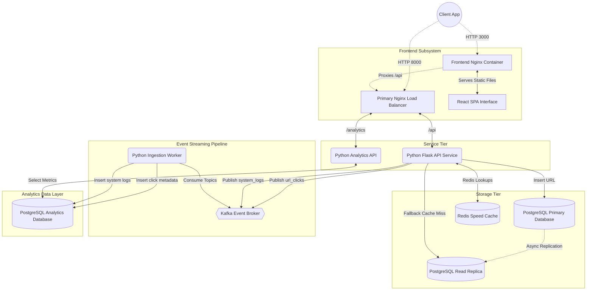
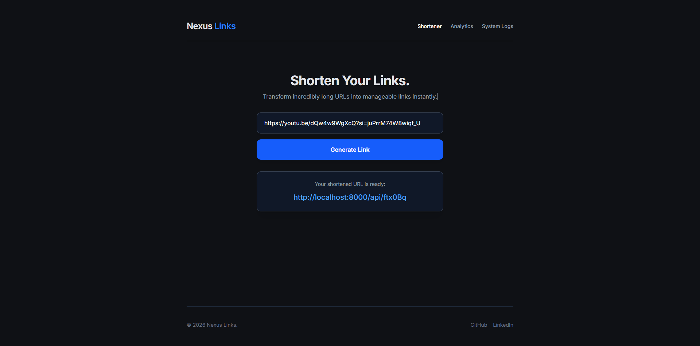
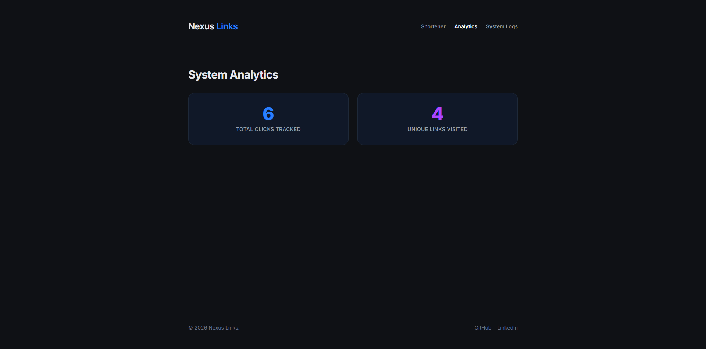
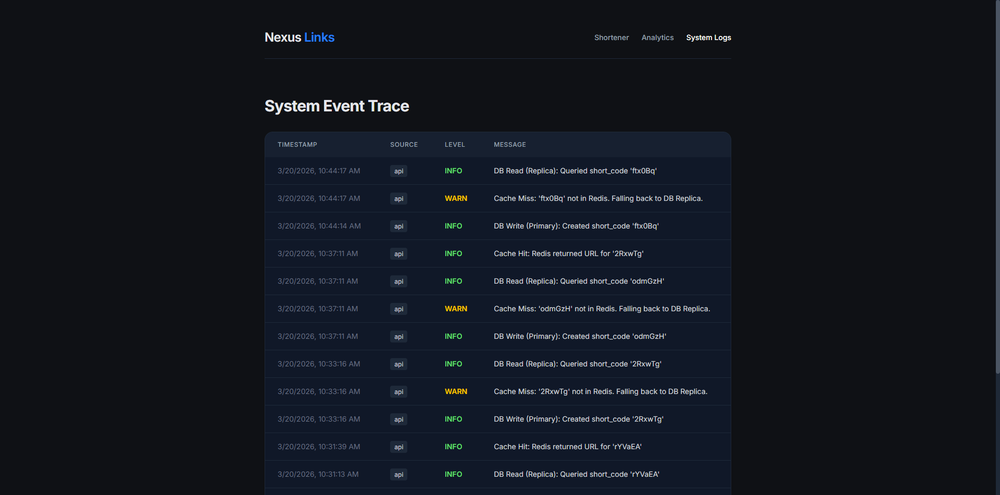
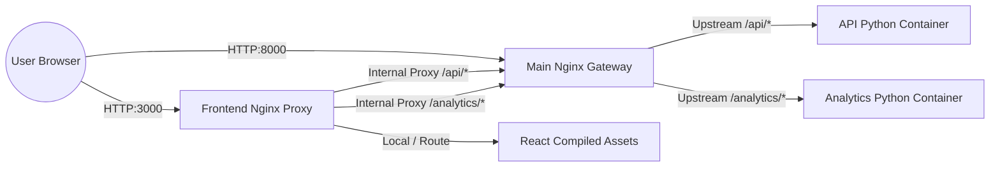
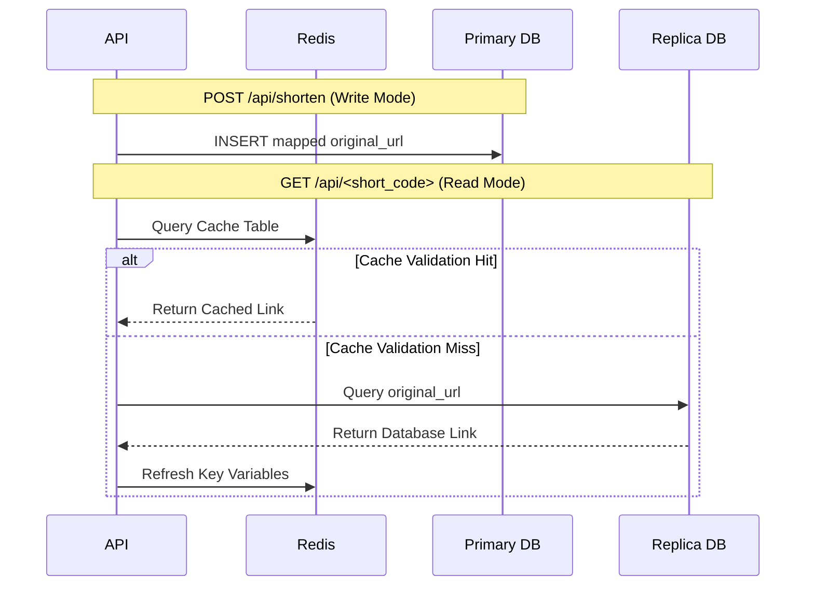
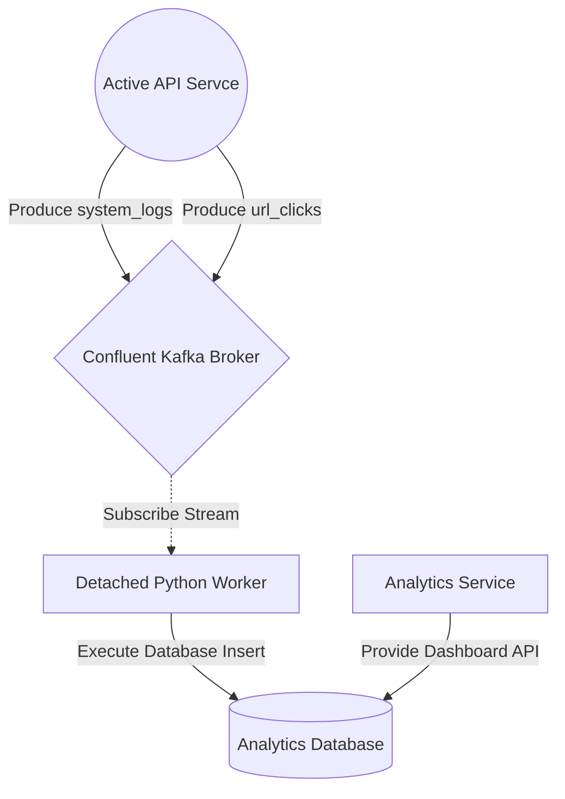

# Nexus URL Shortener

[](https://opensource.org/licenses/MIT)
[](#)
[](#)
[](#)
[](#)
[](#)
[](#)

This repository serves as the first primary project in learning and implementing decoupled, highly scalable system architecture. It strictly implements core distributed systems methodologies, orchestrating precise interactions between backend processing layers, stream data ingestion, performant in-memory caching, and a highly responsive frontend interface.

## Table of Contents
1. [System Architecture](#system-architecture)
2. [Folder Structure](#folder-structure)
3. [Component Design Reasoning](#component-design-reasoning)
4. [Request Flow Logic](#request-flow-logic)
5. [Prerequisites & Output](#prerequisites--output)
6. [Deployment Guide](#deployment-guide)
7. [API Endpoints](#api-endpoints)

## System Architecture

The core philosophy revolves around decoupling reads from writes, enforcing stateless compute layers, and moving heavy metrics calculations completely out of the critical rendering path.



## Screenshots

The project's UI and tracing dashboards.

<figure style="max-width:1100px; margin:0 0 12px 0;">
    
    <figcaption style="font-size:12px; color:#555;">Main page (frontend)</figcaption>
</figure>

<div style="display:flex; gap:16px; flex-wrap:wrap; align-items:flex-start;">
    <figure style="flex:1 1 48%; min-width:260px; margin:0;">
        
        <figcaption style="font-size:12px; color:#555;">Analytics dashboard</figcaption>
    </figure>
    <figure style="flex:1 1 48%; min-width:260px; margin:0;">
        
        <figcaption style="font-size:12px; color:#555;">Event trace and system logs view</figcaption>
    </figure>
</div>


## Deep-Dive Layers

### 1. Load Balancing & Delivery Layer
The architecture deliberately employs a dual-Nginx proxying strategy to effectively eliminate cross-origin resource sharing (CORS) security exceptions while cleanly encapsulating frontend modules:

1. **Frontend Proxy (`frontend/nginx.conf`)**: Rather than running a raw Node instance in production, compiled React files are packaged directly into a hyper-optimized Nginx container. It serves static UI assets natively on Port `3000`. Crucially, it dynamically intercepts any nested API requests designated for `/api/` or `/analytics/`, proxying them seamlessly to the main internal network router to bypass browser cross-origin limits.
2. **Main Routing Gateway (`nginx/nginx.conf`)**: Serves as the centralized backend ingress exclusively handling localized downstream traffic (originating heavily from the frontend container proxy), securely routing traffic upstream to the dedicated Python APIs on Port `8000`.



### 2. Primary / Replica Data Layer
Structural I/O pressure is fundamentally decoupled. Generation logic targets the primary database strictly, while redirection reads fan-out across localized replicas mapping alongside the Redis runtime memory.



### 3. Asynchronous Telemetry Layer
A fully independent operational data pipeline organically insulates the synchronous API operations from external metrics ingestion latency constraints.


## Folder Structure

The repository is modularized natively by service borders to ensure complete execution isolation.

```text
SAP01-URL-Shortner/
├── analytics/                 # Isolated Flask API dedicated to metric aggregation
│   ├── app.py                 # Core routing logic
│   ├── config.py              # Environment assignments
│   ├── Dockerfile             # Alpine Python specification
│   └── requirements.txt       # Dependencies
├── api/                       # Core link generation and resolution API
│   ├── app.py                 # Write and Read processing logic
│   ├── config.py              # Cross service variable mapper
│   ├── Dockerfile             # Gunicorn deployment container
│   └── requirements.txt       # Kafka, Redis, and psycopg2 definitions
├── db/                        # Initialization rules for raw containers
│   ├── analytics.sql          # Ingestion tables (clicks, system_logs)
│   └── urls.sql               # Primary mapping validation structure
├── docs/                      # Graphing logic and rendering definitions
│   └── architecture.mmd       # Mermaid diagram code
├── frontend/                  # React User Interface
│   ├── public/                # Static base objects
│   ├── src/                   # Dynamic component mapping
│   │   ├── App.jsx            # Dark mode Tailwind structure
│   │   └── index.css          # Tailwind abstractions
│   ├── Dockerfile             # Nginx optimized multi-stage builder
│   ├── nginx.conf             # Proxies mitigating frontend CORS boundaries
│   └── package.json           # Node configuration definitions
├── nginx/                     # Primary network routing layer
│   └── nginx.conf             # Upstream server load balancing logic
├── worker/                    # Python polling daemon
│   ├── Dockerfile             # Script containerization instructions
│   ├── requirements.txt       # Confluent consumer dependencies
│   └── worker.py              # Kafka parsing and database insertion mapping
├── .env                       # Centralized global environment overrides
├── docker-compose.yml         # Container mapping framework
├── LICENSE                    # Security and permissions
└── README.md                  # System operation definitions
```

## Component Design Reasoning

Every component within the infrastructure was carefully chosen to solve strict bottlenecks occurring at immense scale:

* **Nginx Load Balancer**: Acting as the tip of the spear, it serves as a unified routing endpoint. It seamlessly proxies external static UI traffic and internal asynchronous API requests simultaneously while securely mitigating connection concurrency limits.
* **Redis Caching**: Integrated intentionally to structurally accelerate short code redirection lookups. Serving repeated heavy read requests directly from RAM completely bypasses disk input output bottlenecks, drastically lowering overall system latency and instantly freeing database constraints.
* **PostgreSQL (Primary and Replica Separation)**: Enforces robust structural data integrity. Utilizing a primary database strictly for write operations while forcing an isolated replica server to handle reads guarantees maximum parallel performance limits. This methodology scales perfectly while establishing deep fault tolerance boundaries without table locking collisions.
* **Kafka and Zookeeper Data Streaming**: Natively captures URL click streams and generic system diagnostic logs instantly upon HTTP redirection. Utilizing an event stream logically prevents the core API from getting clogged executing repetitive analytics computation. The backend thread effortlessly delegates the vast insertion overhead directly to an independent Kafka worker cluster gracefully.

## Request Flow Logic

### Link Generation
1. A client submits a vast external URL to the `/api/shorten` securely mapped by Nginx.
2. The core API instantly validates the structure and securely generates a unique alphanumeric identifier code.
3. The original mapping is strictly inserted into the primary PostgreSQL database to guarantee absolute structural consistency.
4. The system safely publishes an internal system log event back to the Kafka broker verifying successful payload processing logic.

### Link Redirection
1. Connecting clients access a localized short link passing exclusively through the main scalable router.
2. The API actively checks the Redis cache engine first for near instant access rules.
3. Upon experiencing a strict cache miss constraint, the service dynamically initiates a read from the attached PostgreSQL replica instance to fundamentally minimize read pressure against the write heavy primary.
4. Finally, it securely updates the Redis cache memory constraints for future localized hits and initiates an HTTP redirect.

### Asynchronous Analytics Logging
1. Simultaneously, during any redirection procedure, the background API actively emits a silent, zero wait click event directly into a designated Kafka topic cluster.
2. The assigned worker container independently consumes this distinct traffic threshold and strictly writes metadata into the offline analytics database. This directly ensures the primary API request loops effectively remain unblocked, fully lightweight, and highly performant at vast processing scales.
3. Distinct application events (Database writes, Cache misses, Replica hits) are simultaneously serialized onto a system logs topic, organically serving as a comprehensive application audit trail dynamically accessible directly via the frontend metrics dashboard tab.

## Prerequisites & Output

To execute the infrastructure mapping, your local environment requires:
* Docker Engine (v24.0 or newer)
* Docker Compose Module (v2.0 or newer)
* Ports `3000` and `8000` clear of localized bindings

## Developer Workflow & Local Routing

If you are modifying the UI natively and do not want to constantly rebuild the Nginx Container via Docker, you can execute the React app directly via Node.js (`npm run dev`).

**The `vite.config.js` Proxy:**
In a production container, `frontend/nginx.conf` physically manages routing. However, when executing `npm run dev` locally, the `vite.config.js` mirrors this logic natively. It establishes a hot-reloading development server that intercepts any local calls mapping to `/api/` or `/analytics/` and dynamically shifts them into your Dockerized backend `http://localhost:8000` so CORS restrictions are entirely mitigated even outside the container!

## Deployment Guide

The entire structural framework actively provisions precisely out of the box dynamically leveraging Docker Compose.

1. Clone the repository framework locally.
2. Validate Docker Engine core variables.
3. Natively execute the container build script completely within the repository base:
   ```bash
   docker compose up --build -d
   ```
4. Access the unified React frontend cleanly via:
   `http://localhost:3000`

## API Endpoints

The API safely exposes functional automated paths logically located alongside core routes.

### Actions
* `POST /api/shorten`: Generates a fully optimized tracking link requiring JSON payload `{"url": "domain.com"}`.
* `GET /api/<id>`: Standardized fast redirect endpoint querying Redis cache variables then safely escalating to DB replicas.

### Diagnostics
* `GET /analytics/system-stats`: Serves calculated quantitative data verifying database states mapping unique link engagements.
* `GET /analytics/logs`: Aggregates the asynchronous Kafka logging boundaries outputting comprehensive system trace rules across all instances.
